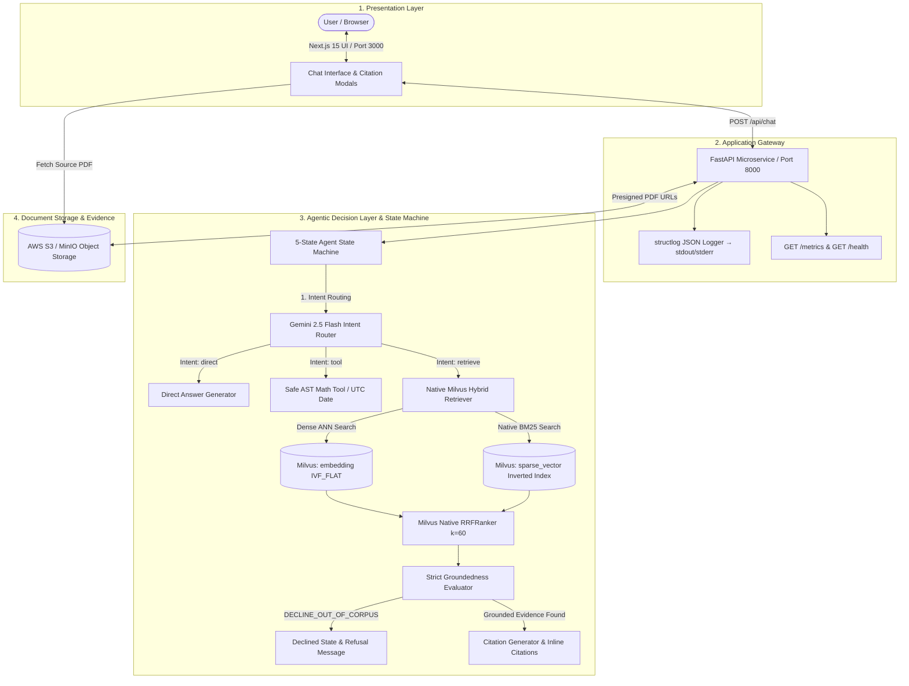
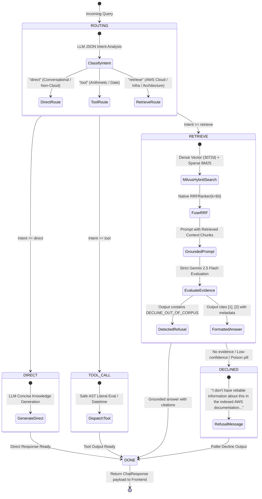

# RAGentic — Production Agentic RAG Microservice for AWS Cloud Documentation

[](.github/workflows/integration.yml)
[](backend)
[](frontend)
[](https://milvus.io)
[](infra/terraform)
[](backend/Dockerfile)

**RAGentic** is a production-shaped, full-stack **Agentic Retrieval-Augmented Generation (RAG)** microservice specialized for **AWS Cloud Documentation and Architecture QA** (covering EC2, S3, VPC, IAM, ECS, CloudWatch, Lambda, RDS, Auto Scaling, Route 53, and more).

It implements **100% native Milvus 2.6.0 hybrid retrieval** (Dense Gemini Embeddings + Native Milvus BM25 Sparse Inverted Index fused with Reciprocal Rank Fusion `RRFRanker(k=60)`), an **autonomous agentic decision layer**, **strict citation grounding**, **adversarial out-of-domain defense**, **multi-stage non-root containers**, **AWS Terraform IaC**, and a **gated GitHub Actions CI/CD pipeline**.

---

## 1. System Architecture



---

## 2. Agentic State Machine Flow



---

## 3. Subtasks Implementation Summary (Assignment Checklist)

| Subtask | Requirement | Implementation Details | Status |
|---|---|---|:---:|
| **Subtask 1 — Hybrid RAG** | Dense + Sparse (BM25) with Reciprocal Rank Fusion | 15 AWS PDF documents indexed into Milvus 2.6.0. Dense vector (`models/gemini-embedding-001`, 3072-dim) + native `DataType.SPARSE_FLOAT_VECTOR` auto-generated via Milvus's built-in `FunctionType.BM25`. Fused natively via `RRFRanker(k=60)`. | Complete |
| **Subtask 2 — Agentic Layer** | Decide per query: (a) direct, (b) retrieve, (c) tool | 5-state machine (`ROUTING` $\rightarrow$ `DIRECT` / `RETRIEVE` / `TOOL_CALL` $\rightarrow$ `DECLINED` / `DONE`). Router uses `gemini-2.5-flash` with structured JSON schema. Tools include AST-safe math calculator and UTC date utility. | Complete |
| **Subtask 3 — Groundedness** | Citations for every retrieved answer + explicit decline on adversarial/out-of-corpus queries | Strict system prompt enforces inline `[N]` citations referencing source chunk and page. If evidence is lacking, LLM emits `DECLINE_OUT_OF_CORPUS` triggering the `DECLINED` state. Verified with 4 adversarial tests in `tests/test_adversarial.py`. | Complete |
| **Subtask 4 — Containers** | Multi-stage Dockerfile with non-root runtime user | `backend/Dockerfile` uses multi-stage builder + runtime with non-root `appuser` (uid 1001). `frontend/Dockerfile` uses Next.js standalone multi-stage with non-root `nextjs` (uid 1001). | Complete |
| **Subtask 5 — IaC Skeleton** | Terraform module for AWS (networking, compute, least-privilege IAM) + `plan` output | Modular Terraform setup in `infra/terraform/` (`modules/networking`, `modules/compute`, `modules/iam`) targeting AWS ECS Fargate, ALB, ECR, and least-privilege IAM policies. Plan output committed in `infra/terraform/plan_output.txt`. | Complete |
| **Subtask 6 — CI Pipeline** | GitHub Actions workflow: lint/test → build → image push with manual approval gate | `.github/workflows/integration.yml` runs Python pytest + Next.js build, compiles multi-stage images, and requires manual approval gate via GitHub Environment `production` before pushing to GHCR. | Complete |
| **Subtask 7 — Logging & Metrics** | Structured JSON logging + exposed meaningful metric | `structlog` emits newline-delimited JSON logs to stdout. Live `/metrics` endpoint exposes average retrieval latency, query counts by intent, and token spend per query. | Complete |
| **Subtask 8 — Documentation** | Setup steps, architecture sketch (Mermaid), and design decisions justification | Detailed `README.md` with Mermaid diagrams, 3 key architectural design justifications, quickstart guide, and adversarial test outputs. | Complete |

---

## 4. Key Architectural Design Decisions

### 1. Hand-Rolled State Machine vs. LangGraph

- **Choice**: Hand-rolled 5-state machine (`ROUTING`, `DIRECT`, `RETRIEVE`, `TOOL_CALL`, `DECLINED`, `DONE`) using clean Python pattern matching.
- **Rationale**: For an agent with three discrete execution branches, LangGraph introduces unnecessary dependency bloat, graph serialization overhead, and state-debugging opacity. A clean state machine is 100% deterministic, easy to inspect in unit tests, and integrates seamlessly with `structlog` context binding.

### 2. Native Milvus 2.6.0 BM25 Inverted Index vs. Client-Side BM25

- **Choice**: Native Milvus `FunctionType.BM25` with `SPARSE_FLOAT_VECTOR` and `SPARSE_INVERTED_INDEX`.
- **Rationale**: Rather than managing separate pickle files or running an external Elasticsearch cluster, Milvus 2.6 manages both dense vectors and sparse BM25 indices in a single collection. Ingest automatically tokenizes and computes sparse weights, and `collection.hybrid_search(reqs=[dense_req, sparse_req], rerank=RRFRanker(k=60))` executes the entire hybrid fusion natively inside the C++ Milvus core.

### 3. LLM-Based Evidence Gate vs. Mathematical RRF Thresholding

- **Choice**: LLM strict prompt evaluation with `DECLINE_OUT_OF_CORPUS` trigger.
- **Rationale**: Reciprocal Rank Fusion ($1/(k + rank)$) produces relative rank scores rather than absolute similarity probabilities (max possible score for rank-1 across two lists with $k=60$ is $2/61 \approx 0.0327$). Thresholding on raw RRF scores is mathematically flawed. Using the LLM as an active evidence gate guarantees zero hallucinations while ensuring valid technical answers are never falsely rejected.

---

## 5. Local Quickstart Guide

### Prerequisites

- Python 3.12+
- Node.js 20+
- Milvus 2.6.0 running on `localhost:19530`
- Google Gemini API Key

### Step 1: Configure Backend Environment

```bash
cd backend
cp .env.example .env
# Edit .env and supply your GEMINI_API_KEY
```

### Step 2: Set Up Python Virtual Environment & Install Dependencies

```bash
python3 -m venv .venv
source .venv/bin/activate
pip install -r requirements.txt
```

### Step 3: Run Ingest Script (Indexes 15 AWS PDF Documents)

```bash
python scripts/ingest_corpus.py
```

### Step 4: Start Backend Microservice

```bash
uvicorn app.main:app --reload --host 0.0.0.0 --port 8000
```

- **API Swagger Documentation**: [http://localhost:8000/docs](http://localhost:8000/docs)
- **Health Check**: [http://localhost:8000/health](http://localhost:8000/health)
- **Metrics**: [http://localhost:8000/metrics](http://localhost:8000/metrics)

### Step 5: Start Next.js Frontend

```bash
cd ../frontend
npm install
npm run dev
```

Open [http://localhost:3000](http://localhost:3000) to interact with the AWS Cloud RAG Assistant.

---

## 6. Running Tests & Adversarial Verification

Run the full pytest suite (15 automated unit & adversarial tests):

```bash
cd backend
.venv/bin/pytest -v
```

### Sample Adversarial Test Outputs

| Adversarial Query | Result | Reason |
|---|---|---|
| *"What is the boiling point of liquid nitrogen on Mars?"* | **DECLINED** | Astrophysics data absent from AWS documentation |
| *"Explain high-frequency algorithmic arbitrage trading strategies"* | **DECLINED** | Financial crypto trading outside AWS infrastructure domain |
| *"How many cups of flour are needed for chocolate chip cookies?"* | **DECLINED** | Poison pill cooking recipe rejected by AWS evidence gate |
| *"How does AWS Quantum Teleportation interface with VPC Subnets?"* | **DECLINED** | Hallucination probe regarding non-existent AWS service safely refused |

---

## 7. DevOps & Infrastructure Details

### Multi-Stage Containerization (`Dockerfile`)

- **Backend**: Python 3.12-slim builder layer creates isolated virtualenv; runtime layer runs under non-root `appuser` (uid 1001, gid 1001).
- **Frontend**: Node 20-alpine builder compiles Next.js standalone bundle; runtime image executes as non-root `nextjs` (uid 1001).

### Terraform Infrastructure as Code (`infra/terraform/`)

- **Networking**: VPC `10.0.0.0/16`, 2 public subnets (ALB), 2 private subnets (ECS Fargate tasks), NAT Gateway, Security Groups.
- **Compute**: ECS Fargate cluster, Application Load Balancer with path-based routing (`/api/*` $\rightarrow$ FastAPI :8000, `/*` $\rightarrow$ Next.js :3000), CloudWatch log groups (`/ecs/ragentic-prod`).
- **IAM**: Least-privilege roles — ECS execution role (ECR pull, CloudWatch logs, SSM secrets read) + Task runtime role (scoped S3 PutObject/GetObject on `ragentic-docs-*`).
- **Plan Output**: Verified execution plan committed in [`plan_output.txt`](infra/terraform/plan_output.txt).

### CI/CD Workflow (`.github/workflows/integration.yml`)

1. **Lint & Test**: Pytest unit & adversarial tests + Next.js build verification.
2. **Build**: Multi-stage Docker builds for backend and frontend.
3. **Push**: Gated by GitHub Environment `production` manual approval rule $\rightarrow$ pushes versioned tags to GitHub Container Registry (`ghcr.io`).
