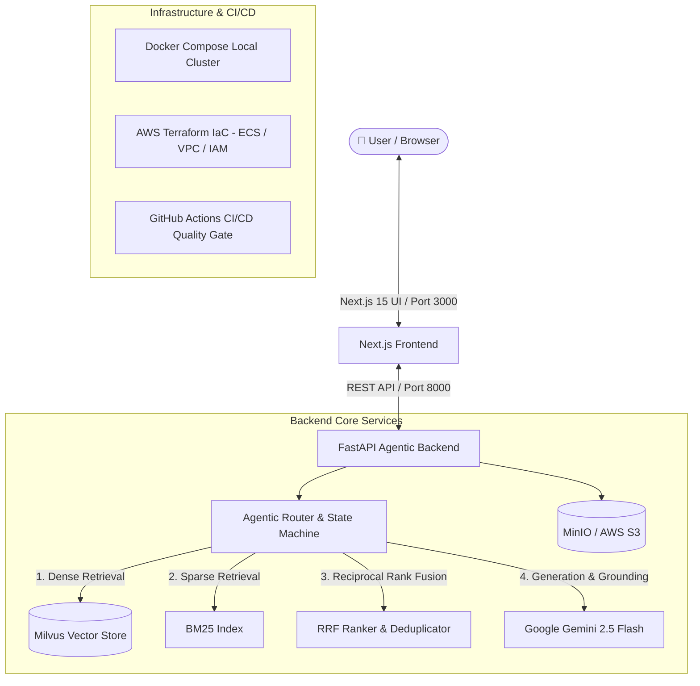

# 🤖 RAGentic — Agentic Retrieval-Augmented Generation Platform

[](.github/workflows/integration.yml)
[](backend)
[](frontend)
[](https://milvus.io)
[](infra/terraform)
[](infra/docker-compose.yml)

**RAGentic** is an enterprise-grade, end-to-end **Agentic RAG (Retrieval-Augmented Generation)** application built as a modern full-stack monorepo. It features hybrid retrieval (Dense Gemini Embeddings + Sparse BM25 with Reciprocal Rank Fusion), autonomous agentic tool routing, citation-grounded generation, adversarial prompt injection defense, and infrastructure-as-code deployment.

---

## System Architecture



---

## Repository Monorepo Structure

```text
RAGentic/
├── .github/
│   └── workflows/
│       └── integration.yml     # Automated CI/CD (Lint, Pytest, Docker build, GHCR push)
├── backend/                    # FastAPI Microservice & RAG Engine
│   ├── app/
│   │   ├── agent/              # Agent router, state machine, tools & LLM client
│   │   ├── api/                # FastAPI endpoints (chat, documents, health)
│   │   ├── models/             # Pydantic schemas (requests, responses, citations)
│   │   ├── rag/                # Hybrid retriever, embedder, ingestor, Milvus store
│   │   └── storage/            # S3 / MinIO object storage integration
│   ├── corpus/                 # Reference document corpus
│   ├── scripts/                # Ingestion scripts
│   ├── tests/                  # Unit, retriever, and adversarial injection tests
│   ├── Dockerfile              # Multi-stage production container
│   ├── pyproject.toml          # Python package metadata & dependencies
│   └── requirements.txt
├── frontend/                   # Next.js 15 Web Application
│   ├── src/
│   │   ├── app/                # App router (chat interface, layout)
│   │   ├── components/         # ChatWindow, Citations, Thinking Indicator, Modals
│   │   ├── hooks/              # useChat & useThreads custom hooks
│   │   └── lib/                # API client & utilities
│   ├── Dockerfile              # Production multi-stage Next.js container
│   ├── package.json
│   └── tailwind.config.ts
├── infra/                      # Infrastructure as Code & Orchestration
│   ├── docker-compose.yml      # 1-command local cluster (Backend, Frontend, Milvus, MinIO, Etcd)
│   └── terraform/              # AWS Terraform modules (Compute, Networking, IAM, S3)
├── .gitignore                  # Monorepo git exclusion rules
└── README.md                   # Project documentation
```

---

## Quickstart (One-Command Run with Docker Compose)

The easiest way to run the entire stack locally (Frontend, Backend, Milvus Vector DB, MinIO S3, and Etcd):

### 1. Set Your Gemini API Key
```bash
export GEMINI_API_KEY="your-google-gemini-api-key"
```

### 2. Start the Cluster
```bash
docker compose -f infra/docker-compose.yml up --build
```

### 3. Access the Services
- **Web UI (Frontend)**: [http://localhost:3000](http://localhost:3000)
- **API & Swagger Docs**: [http://localhost:8000/docs](http://localhost:8000/docs)
- **MinIO Console**: [http://localhost:9001](http://localhost:9001) (User: `minioadmin` / Pass: `minioadmin`)
- **Milvus Vector DB**: `localhost:19530`

---

## Local Development Setup

### Backend (Python 3.12 + FastAPI)

1. **Navigate to the backend directory and set up a virtual environment:**
   ```bash
   cd backend
   python3.12 -m venv .venv
   source .venv/bin/activate
   ```

2. **Install dependencies:**
   ```bash
   pip install -r requirements.txt
   pip install -e ".[dev]"
   ```

3. **Configure environment:**
   ```bash
   cp .env.example .env
   # Edit .env and supply your GEMINI_API_KEY
   ```

4. **Run development server:**
   ```bash
   uvicorn app.main:app --reload --host 0.0.0.0 --port 8000
   ```

5. **Run test suite (Unit & Adversarial prompt injection tests):**
   ```bash
   pytest -v --tb=short
   ```

---

### Frontend (Next.js 15 + Tailwind CSS + TypeScript)

1. **Navigate to the frontend directory:**
   ```bash
   cd frontend
   ```

2. **Install dependencies:**
   ```bash
   npm install
   ```

3. **Run development server:**
   ```bash
   npm run dev
   ```
   Open [http://localhost:3000](http://localhost:3000) in your browser.

---

## Key Features & Engineering Highlights

- **Hybrid Search Engine**: Combines sparse lexical matching (`BM25`) with dense vector semantic search (`models/gemini-embedding-001` via `Milvus`), fused via Reciprocal Rank Fusion (RRF).
- **Agentic State Machine**: Autonomous routing deciding whether to answer directly, retrieve documents, perform multi-hop searches, or refuse out-of-scope/adversarial queries.
- **Citation & Grounding Verification**: Every claim in the agent's output is linked to chunk IDs and document source snippets.
- **Adversarial & Guardrail Testing**: Dedicated test suite verifying immunity against prompt injection, jailbreaking, and system prompt leakage.
- **Automated CI/CD Quality Gate**: GitHub Actions runs automated linting, Python pytest suites, Next.js build verification, and multi-stage container builds.
- **Cloud-Ready Terraform IaC**: Modular Terraform definitions for AWS VPC, ECS Fargate, IAM least-privilege roles, and encrypted S3 document buckets.

---
